### 数据分析过程（以水资源数据为例）  

作者：Loyio （李斯特）

写于2018年5月

pdf离线文档下载

[下载地址](https://raw.githubusercontent.com/loyio/Mynote/master/BigData/数据分析过程（以水资源数据为例）.pdf)

目录：

[TOC]

> 本篇文章只做大数据分析比赛（第一组）参考用，如果其中有错误的分析言论，请及时联系我做出更改，水资源的数据太少了，但比较容易展示数据分析过程  

#### 一：数据预处理

> 现实世界中数据大体上都是不完整，不一致的脏数据，无法直接进行数据分析，或分析结果差强人意。数据预处理有多种方法：数据清理，数据集成，数据变换，数据归约等。把这些影响分析的数据处理好，才能获得更加精确地分析结果。  

##### 1.查看表名

首先拿到数据，先查看有几张表，如水资源分析数据，共三张表  

    

分别是

1. 五年水资源
2. 五年供水用水
3. 五年废水主要污染物排放  

##### 2.查看字段名

然后，分别对每个表进行预观察

- 五年水资源

  - 横向数据类型（行）

    - 2014年
    - 2013年
    - 2012年
    - 2011年
    - 2010年

  - 纵向数据类型（列）

    - 人均水资源量（立方米/人）
    - 地下水资源量（亿立方米）
    - 地表水与地下水资源重复量（亿立方米）
    - 地表水资源量（亿立方米）
    - 水资源总量（亿立方米）  

    

> 其余两张表分类相似

通过以上的横向与纵向相互分析，我们就可以得到，这个数据他能体现什么  

##### 3.特殊情况

在数据预处理中，我们要注意以下几点：

1. 去除重复无用的数据
2. 对于有残缺的数据可以尝试使用以下两种方法处理
   1. 去掉数据
   2. 通过临近值补全数据
3. 数据的分组要基于实际预分析  

比如我在第三张表，也就是 五年废水主要污染物排放 发现了一个问题

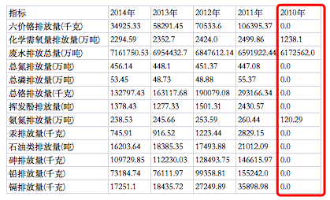

2010年的数据指标，与其他年份相差太大，这时就应该考虑是统计误差问题（当然误差这个词说的有点不准确），还是真实的情况体现（如果数据是真的，那么我就想是不是2010年与2011年以间是不是有什么很大的新闻）  

#### 二：发现数据特征

> 通过第一步对数据的预处理，我们应该能够大概清楚这个数据集的简单的线性关系，当然没有讨论到数据本身

  

##### 1.拆分表名

例如水资源这个数据集，我们从表名就能大概清楚一些特征（分词法）

表名：`五年水资源`

五年：包含五年的数据，这也是我们第一步得出的行特征，从2010年到2014年的数据

水资源：数据是关于水资源的，如第一步得出的列特征，包含人均水资源量，地下水资源量等数据  

然后，我们再次来分析表名：`五年水资源` 

很显然，水资源这个词相比五年更容易成为一个关键词  

##### 2.获取问题

下一步，我们必须要了解水资源相关的新闻，资料，这样才能对后续的数据分析有帮助

> 如果分析一个数据集，连这个数据集里面讲的是什么都不知道，那真的就是一点数据分析的思路都没有，比如，我们示例数据集中的索赔率分析
>
> 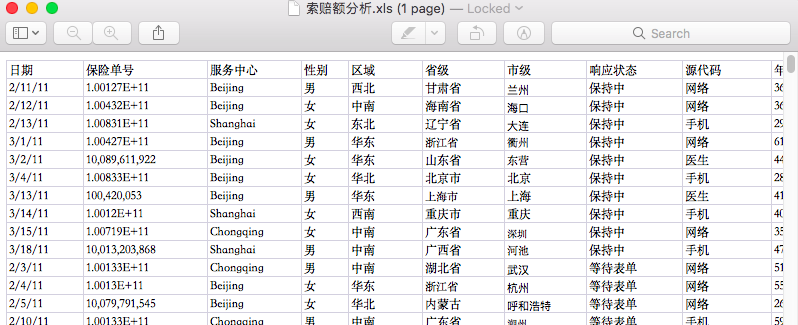
>
> 刚开始看到这个数据集时，我是懵逼的，什么说明信息都没有，只是给了我们这么一张excel表，其中有些字段我根本就看不懂（俺只是个敲代码的人）
>
> 比如响应状态，源代码（难道不是程序源代码吗），索赔率，赔付率，完全不懂
>
> 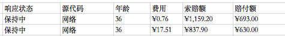  
>
> 
>
> 当然不能因为有障碍就放弃啊，在接下来的时间，我不断的查阅资料，百度、google，慢慢对这张表有了兴趣，了解如何对数据进行分析

  

通过在网上搜索，我了解到了我国目前水资源主要问题

1、水资源缺乏；

2、用水浪费严重；

3、水质污染得不到改善；

4、水土流失严重得不到控制；

5、水资源的开发利用不合理；

6、人民节约用水意识不够；

7、政府部门对水资源的管理不是太强。

  

*当然网上查到的，远远不止这些，我只是在这做个例子*

  

##### 3.逐表分析

有了问题，我们分析数据的兴趣自然也就来了

比如第一张表，我们可以简单概况为"从2010年到2014年水资源的资源量情况（减少了还是增多了）" 

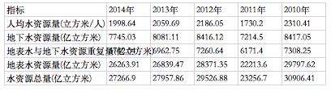

  

第二张表，可以概括为‘‘从2010年到2014年用水量与供水量指标增长与减少情况表’（当然，特征远远不止这些，比如换个角度，只看供水总量和用水总量，可以通俗概括为供了多少水，就用了多少水）

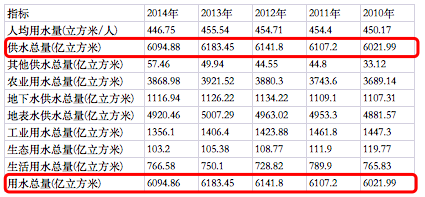

  

第三张表，也就是那张看起来有点问题的表，我们可以简单概括为“五年间（2010-2014）各污染排放量之间的数量情况”

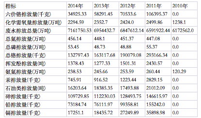

> 刚开始看到这张表的时候，我在想是不是要把化学老师请出来讲讲 😂  

对于这些表的数据，我们无需死扣字眼，不要因为里面的一些信息自己不太懂，就不断的要弄懂他们，比如我们无需清楚这些元素哪个更污染水资源，我们只需要知道他们都是污染排放物即可，根据数据做出分析即可  

有了问题，和数据的特征，我们就可以动用工具更直观的对数据进行分析  

#### 三：使用魔镜进行数据分析

> 本来以为要自己写程序，自己搭建大数据分析平台，自己画图…..
>
> 竟然有了这个可以免费使用的工具，那当然不能错过了

  

首先打开网站，登录账号，选择新建应用

然后选择数据类型

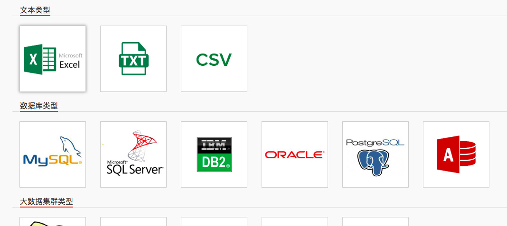

我们这个数据是xlsx表格，所以我们就选择第一个Excel表格，然后点击下一步

选择文件上传，上传成功后会显示数据预览，查看数据是否齐全，是不是每张表都有

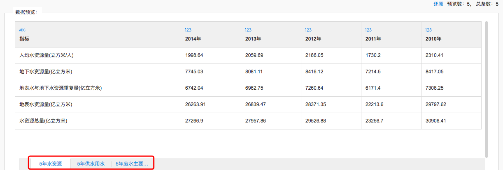

检查完后，输了数据源名称就可以点击保存了

然后，呈现的就是这样一张图

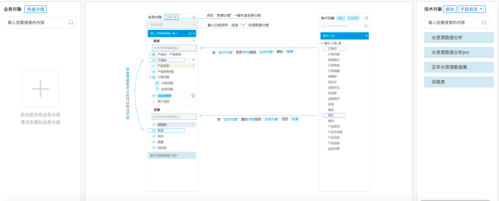

第一次，看到这个的时候，内心😭,(这些都是什么啊，都看不懂啊)

于是想到群里不是有说明文档吗，拿来看看，打开后

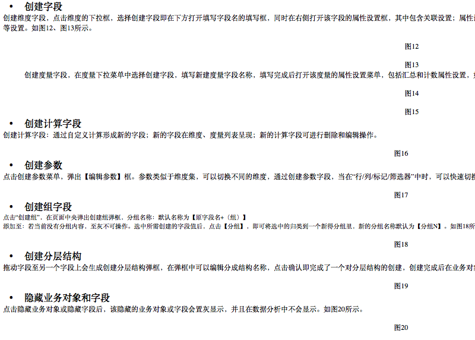

完全对操作没有一点帮助啊，不懂的还是不懂啊

抱着试一试的心态，自己捣鼓了一下这个系统，发现其实还好

##### 1.添加分组

在数据处理，面板，最左边有添加业务分组，和快速分组

这两个选项都可以点，我们在这点击上面的快速分组，然后选择快速分组

然后弹出这样一个面板

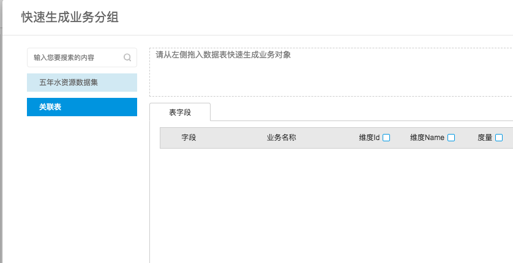

注意到，旁边有我们刚刚导入的excel数据表，我前面命名的是五年水资源数据集，还有一个关联表，暂时先不用管

我们双击五年水资源数据集

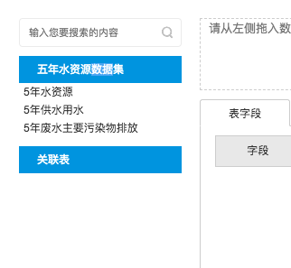

可以看到，里面正是我们刚开始预览数据的三张表，我们首先拖动**五年水资源**到虚线内

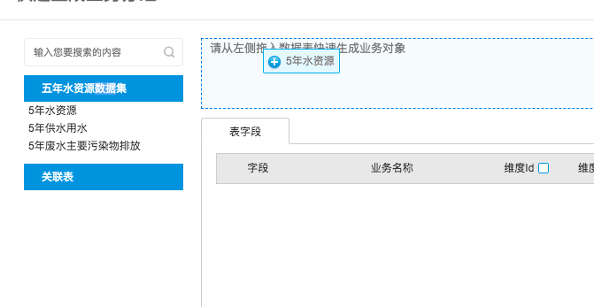

然后下面就会出现表字段等数据

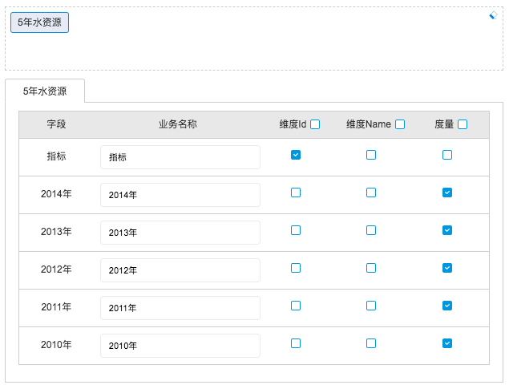

可以看到，他是以第一行的名称做特征字段的

注意你在拖动的时候，如果有错误，可以将其脱出，或者还可以点击清空按钮

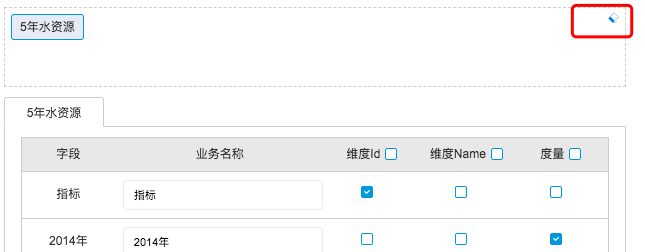

下一步，点击输入名称，确认即可

这个时候在数据处理面板的左侧，就会看到我们添加的业务对象了

我们可以在这对某些属性进行更改，以便数据分析

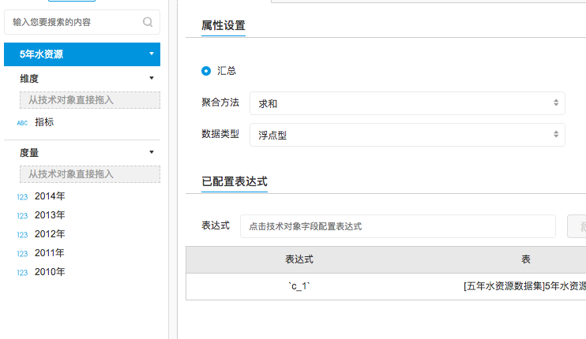

例如，我们可以更改聚合方法

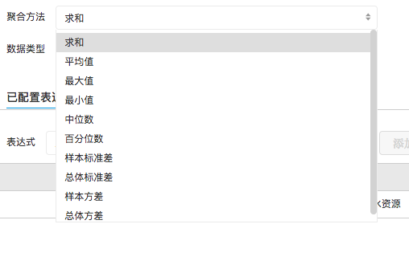

当然，在这里我们暂时不对这个做出讨论更改

为了简便的展示操作，数据处理页面操作暂时不做过多讨论

##### 2.简单表格

下一步，我们开始正式运用这个系统

首先点击导航栏上的**数据分析**

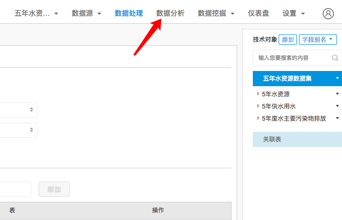

然后，我们进入了一个全新的界面

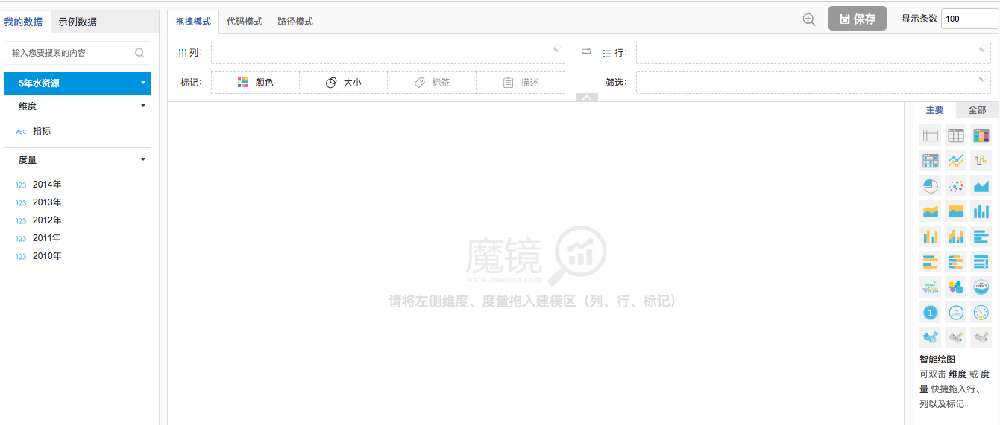

最左边的区域，相信都很熟悉，就是我们刚刚添加的业务对象，在这被作为要处理的数据

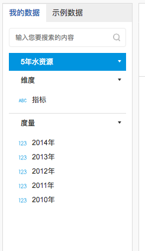

中间我们，暂时不做讨论，最右边可以看到有很多图表类型，分为主要和全部

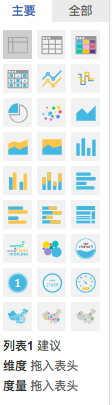

------

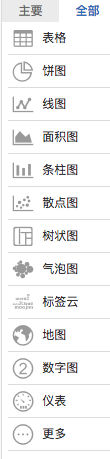

区别很明显了，当鼠标悬置在全部中的某个标签时，会有更多详细情况

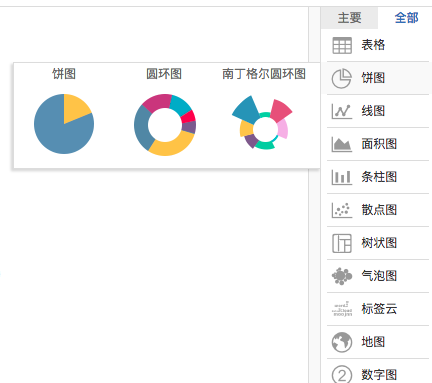

下一步，我们正式开始来绘制图表，点击主要中的第一个标签，也就是**列表1**

然后在中间的区域，我们可以看到有三个选项

默认拖拽模式，我们从左边的数据中，按照顺序依次拖拽进表头

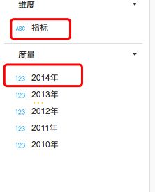

也就是最后，表头中会有所有的特征，如下图所示

然后我们可以看到，下面的显示区域，变成了表格的形式(而且是不是和之前的excel一模一样)

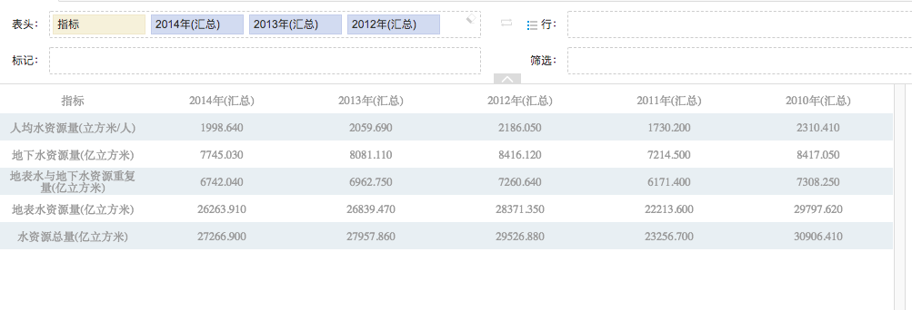

鼠标悬停在表格的单元格上会显示详细信息

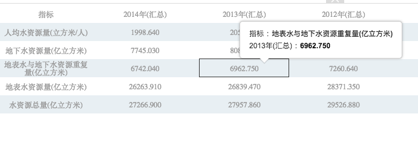

##### 3 选择图表

> 基本统计图形的绘制、数据取值的转换、数据的正态化处理等，能够帮助我们掌握数据的分布特征，是进一步深入分析和建模的基础。 

完成以上步骤后，就可以进行进一步的分析了，选择合适的图表，以达到可视化数据的目的

回顾我们之前的预处理分析，这个跟年份有关，所以我们要显示出一种梯度的数据图表

以获得这五年的水资源变化情况

比如我们制作的这一张图

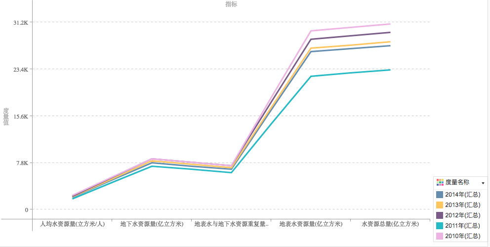

实际曲线并无多大用处，尽管我们可以在其中找到一些突破口

通过不断的尝试，最终还是不能正常获得，这个反应时间变换的曲线图

于是我就想到通过对excel表做转置(当然，首次使用这个魔镜平台，难免会有一些问题，之后我们我们就可以根据情况提前做转置)

刚开始的excel表

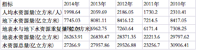

转置后的excel表（转置就是切换行和列，数据没有发生变化）（如何转置，可以自行上网搜索）

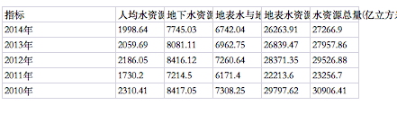

接下来，我们重新上传数据文件(可以看到和之前完全不同)

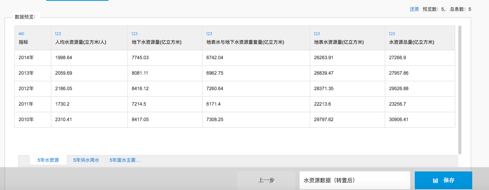

因为接下来的操作跟之前一模一样，我就不详细附图了

填入名称，点击保存后

我们新建了一个分组

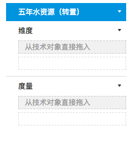

然后从最左边的技术对象中拖入

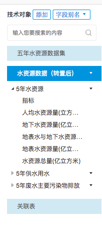

拖入后，显示如下图，（注意每次拖入要点击小勾确认）

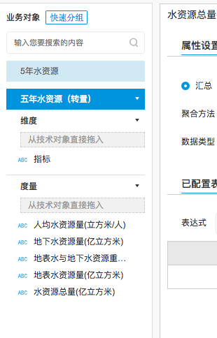

拖动数据到列和行等选框中，再选择图表模型，即可得到想要的图表

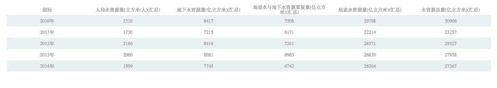

最需要的曲线图

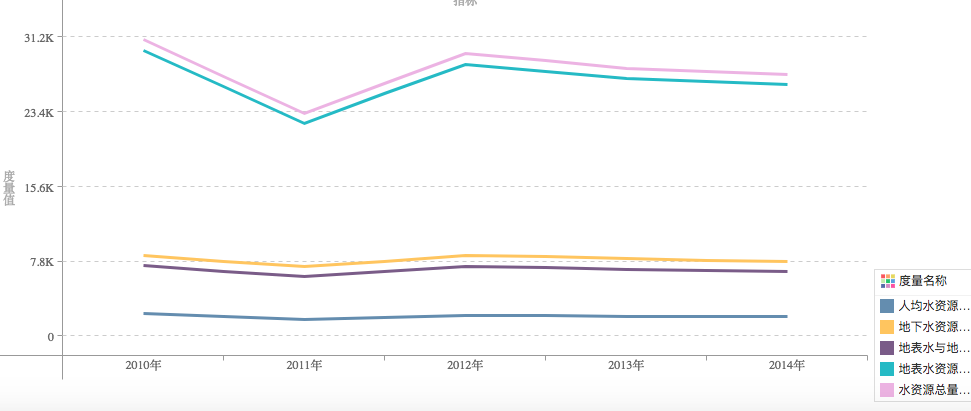

其他图表的绘制我不在这做过多的解释了，多试就会有好结果

##### 4. 保存图表

对图表满意后，便可以保存图表，以便以后查阅

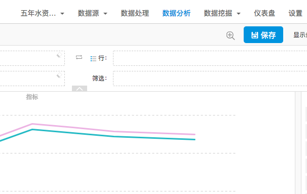

点击保存后，你就会跳到仪表盘，这里面存储的都是你保存好的图表

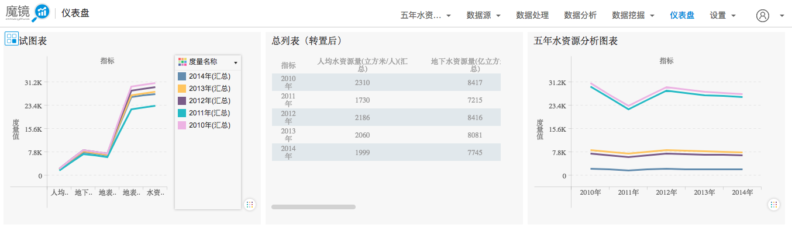

当鼠标悬置到某个图表上，就会出现两个按钮

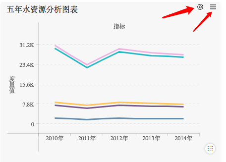

第一个是设置图表的一些格式，如下图

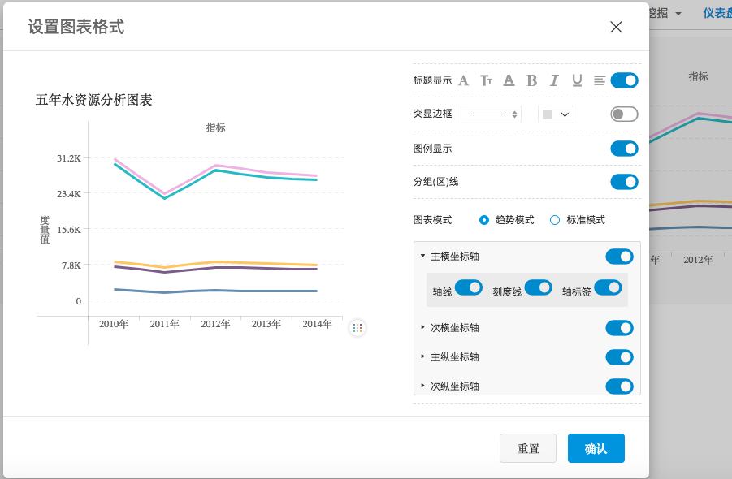

第二个，就是一些常用的操作

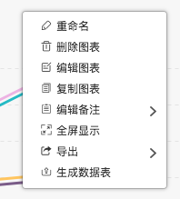

至此，魔镜的主要操作大约就是这些，接下来就是根据图表进行分析了

#### 四：根据图表进行文字表述

未完待续

