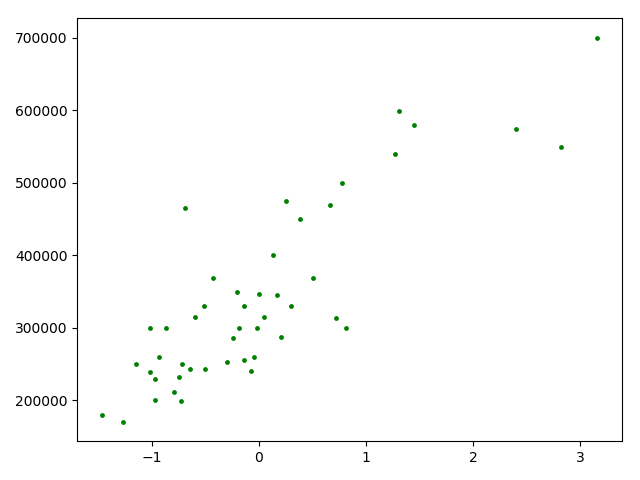

##### 问题的引出

实际问题：现有47个房子的面积和价格，需要建立一个模型对新的房价进行预测（问题来自斯坦福大学机器学习课程）

问题分析：

- 输入数据只有一维，即房子的面积
- 目标数据也只有一维，即房子的价格
- 下面需要做的就是根据已知的房子的面积和价格的关系进行机器学习

数据集地址 ：

> https://github.com/susmote/DeepLearning/blob/master/FirstSample/prices.txt	

从数据集中简单抽出几条如下表所示

| 房子的面积 | 房子的价格 |
| ---------- | ---------- |
| 2104       | 399900     |
| 1600       | 329900     |
| 2400       | 369000     |

虽然要分析的类型非常简单，但是数字都比较大，所以我们应该对它做简单的处理已降低复杂度

将输入数据标准化，公式如下：
$$
X = \frac{X  - \overline{X} }{std(x)}
$$
$\overline{X}$表示 $X$(房子面积)的均值、$std(X)$表示 $X$ 标准差

代码的实现如下

```python
author = "susmote"

import numpy as np

import matplotlib.pyplot as plt

x, y = [], []

for sample in open("./prices.txt", "r"):

    _x, _y = sample.split(",")

    x.append(float(_x))

    y.append(float(_y))

x, y = np.array(x), np.array(y)

x = (x - x.mean()) / x.std()

plt.figure()

plt.scatter(x, y, c = "g", s = 6)

plt.show()

```


代码的运行结果如下图所示




> 横轴是标准化后的房子面积，纵轴是房子价格
>
> 这一步，我们进行了数据的预处理


#### 选择与训练模型

通过线性回归中的多项式拟合来得到一个不错的结果


数学表达式如下：
$$
f(x |p;n) = p_0x^n + p_1x^{n-1} + ... + p_{n-1}x + p_n
$$

$$
L(p; n) = \frac{1}{2} \sum_{i = 1}^m [f(x | p; n) - y]^2
$$

其中$f(x | p;n)$ 就饿是我们的模型，$p$、$n$都是模型的参数，其中$p$是多项式$f$的各个系数，$n$是多项式的次数

$L(p;n)$则是模型的损失函数


下面我们编写代码来进行训练

```python
x0 = np.linspace(-2, 4 ,100)
def get_model(deg):
    return lambda input_x=x0 : np.polyval(np.polyfit(x, y, deg), input_x)
#polyfit(x, y, deg) 返回L(p;n)
#polyval(p, x):根据多项式的各项系数p和多项式中x的值，返回多项式的值y
```


#### 评估与可视化结果

我们采用 $n = 1, 3,10$这三组参数进行评估

代码如下

```python
#根据参数n、输入的x、y返回相对应的损失
def get_cost(deg, input_x, input_y):
    return 0.5 * ((get_model(deg)(input_x) - input_y ) ** 2), sum()

test_set = (1, 4, 10)
for d in test_set:
    print(get_cost(d, x, y))
```


用画图来直观的了解是否出现过拟合

下面是代码

```python
plt.scatter(x, y, c = "g", s = 20)
for d in test_set:
    plt.plot(x0, get_model(d)(), label ="degree = {}".format(d))
    
plt.xlim(-2,4)
plt.ylim(1e5, 8e5)
plt.legend()
plt.show()
```

运行结果如图所示


