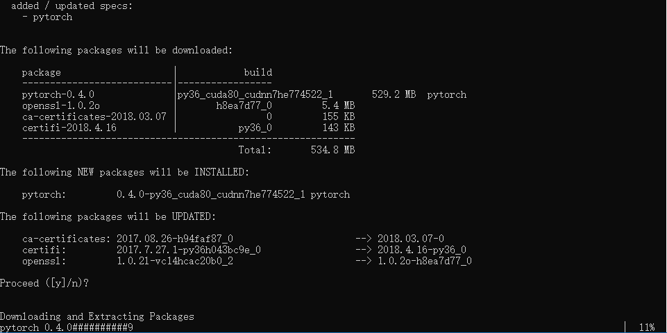

##  安装PyTorch


#### PyTorch简介

PyTorch是一个基于Python的深度学习平台，该平台具有如下特点：

- 简单易用上手快：这一点相信对于深度学习的初学者来说是极具杀伤力的。学习过程总是痛苦的，谁不愿意尽可能地缩短这个痛苦的过程呢？
- 功能强大：从计算机视觉、自然语言处理再到深度强化学习，PyTorch的功能可谓是异常强大。更有甚者，据笔者所知，越来越多的支持PyTorch的工具包正在不断被开发出来，例如用于自然语言处理的Allen NLP，用于概率图模型的Pyro等等，这些包无疑扩展了PyTorch的功能。
- Python化编程：在诸多深度学习开源平台中，PyTorch恐怕是和Python结合最好的平台之一。相比较TensorFlow这种蹩脚的平台来说，PyTorch将会让你的代码更流畅、舒服。
- 强大的社区支持：对于一个小白来说，找到老司机来交流经验恐怕是最迫切的需要了。尽管PyTorch的年龄还很短（仅仅一岁有余），但是它的社区却成长飞快。在国外，PyTorch有着完整的使用教程、说明文档，以及配套的论坛。在StackOverflow这类问答社区上有大量的有关PyTorch的问答。在国内，用PyTorch作为关键词就能搜索到大概五六个网络社区、BBS。各大问答类网站对于PyTorch的问题数目也在持续增多。


> 除此之外，PyTorch既有悠久的历史（它的前身是Torch，这是义工用Lua写的机器学习框架），同时又受到包括脸书、NVIDIA（著名显卡生产厂商）、优步等大公司以及斯坦福大学、卡内基梅隆大学等著名高校的支持。


####PyTorch官网 		pytorch.org


#### 安装PyTorch

##### Linux

- conda安装

  ```bash
  conda install pytorch torchvision -c pytorch
  ```

- pip安装

  ```bash
  pip3 install torch torchvision
  ```


##### OSX

- conda安装

  ```bash
  conda install pytorch torchvision -c pytorch 
  ```

- pip安装

  ```bash
  pip3 install torch torchvision 
  ```


##### Windows

- conda安装

  ```bash
  conda install pytorch -c pytorch 
  pip3 install torchvision
  ```

- pip安装

  ```bash
  pip3 install http://download.pytorch.org/whl/cu80/torch-0.4.0-cp36-cp36m-win_amd64.whl 
  pip3 install torchvision
  ```


##### Windows conda安装记录

安装PyTorch

安装过程非常缓慢



安装失败，http错误


#####Windows pip安装记录

直接执行以下命令

```bash
pip3 install http://download.pytorch.org/whl/cu80/torch-0.4.0-cp36-cp36m-win_amd64.whl 
pip3 install torchvision
```

事实是安装过程极其缓慢，下载文件太大


解决方法

直接把链接`http://download.pytorch.org/whl/cu80/torch-0.4.0-cp36-cp36m-win_amd64.whl`复制到浏览器，下载即可

下载完后，我直接执行以下命令

```bash
pip install E:\susmote\Documents\torch-0.4.0-cp36-cp36m-win_amd64.whl
```

提示安装成功

然后在执行以下命令

```bash
pip3 install torchvision
```

这样就算是安装成功了


通过测试，检测是否可用

```python
In [3]: import torch

In [4]: torch.__version__
Out[4]: '0.4.0'
```


